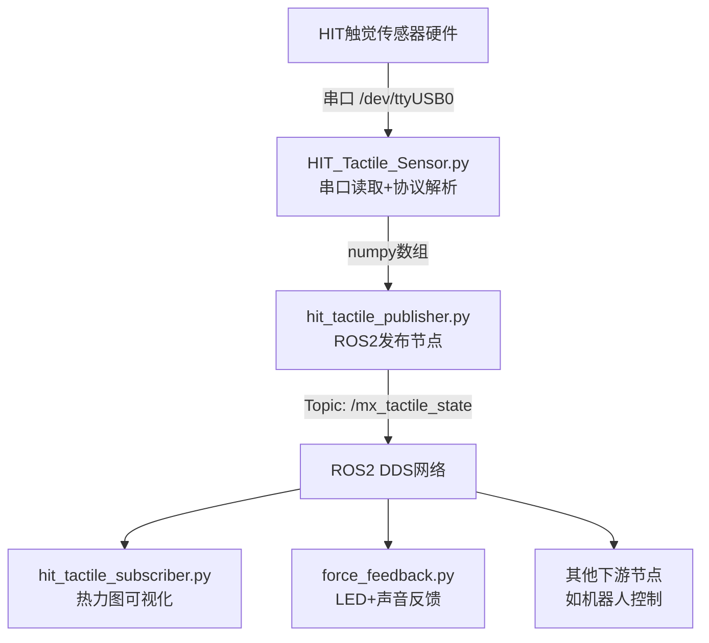
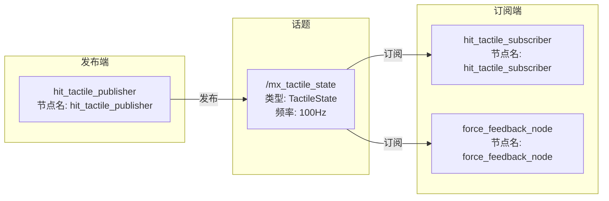
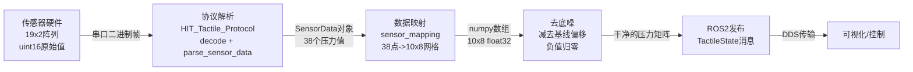
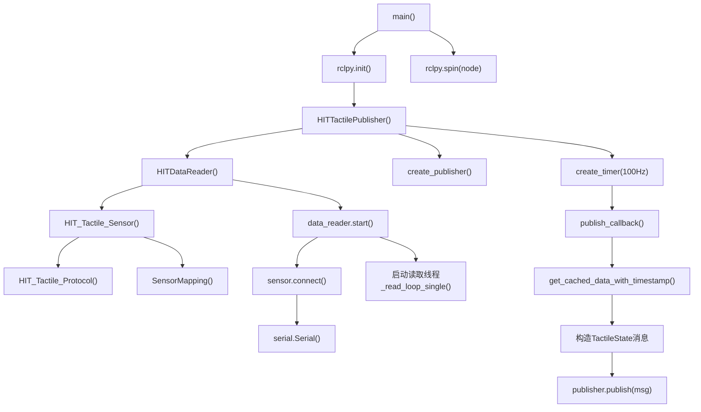

# HIT触觉传感器项目完整导读

---

## 一、项目一句话总结

**这是一个触觉传感器驱动与数据发布系统，通过串口读取HIT（华威科）触觉传感器的压力阵列数据，经过协议解析和映射处理后，以ROS2 Topic的形式发布出去，供下游节点（可视化、力反馈等）使用。**

---

## 二、项目整体判断

### 2.1 属于具身智能的哪个方向？

**传感器驱动 + 数据采集 + 触觉感知可视化**

这个项目处于具身智能系统的**最底层**——感知层。它不做模型推理、不做控制决策，它的职责是：
- 把硬件传感器的原始数据读出来
- 转换成标准格式
- 通过ROS2发布给上层系统使用

### 2.2 项目的输入是什么？

**力传感器数据（压阻式触觉阵列）**

具体来说：
- 通过**串口**（`/dev/ttyUSB0`等）读取
- 传感器输出的是 **19行x2列 = 38个压力点** 的uint16原始值
- 波特率 921600
- 通信协议是自定义的二进制帧协议

### 2.3 项目的输出是什么？

- **ROS2 Topic**: `/mx_tactile_state`（消息类型 `TactileState`）
- **可视化结果**: 热力图（matplotlib / tkinter）
- **力反馈**: LED颜色变化 + 蜂鸣声音（`force_feedback.py`）

### 2.4 项目最终怎么运行起来的？

```bash
python3 hit_tactile_publisher.py        # 启动发布节点（读传感器 -> 发布ROS2话题）
python3 hit_tactile_subscriber.py       # 启动订阅节点（接收话题 -> 显示热力图）
python3 force_feedback.py               # 启动力反馈节点（接收话题 -> LED+声音）
```

### 2.5 最关键的5个文件

| 优先级 | 文件 | 角色 |
|--------|------|------|
| 1 | `HIT_Tactile_Protocol.py` | 协议层：定义通信帧格式 |
| 2 | `HIT_Tactile_Sensor.py` | 业务层：封装传感器读取 |
| 3 | `sensor_mapping.py` | 数据映射：一维到二维网格 |
| 4 | `hit_tactile_publisher.py` | ROS2发布节点（核心） |
| 5 | `hit_tactile_subscriber.py` | ROS2订阅+可视化 |

---

## 三、目录结构解释

```text
HIT_sensor_ws/
├── HIT_Tactile_Protocol.py      # 【必读】协议层：帧编解码、CRC校验、数据解析
│                                 #   被 HIT_Tactile_Sensor.py 和 sensor_gui.py 调用
│
├── HIT_Tactile_Sensor.py        # 【必读】业务层：传感器连接、读取、流式采集
│                                 #   被 hit_tactile_publisher.py 和 update_visual_tactile.py 调用
│
├── sensor_mapping.py            # 【必读】数据映射：38个传感器点 -> 10x8网格
│                                 #   被 HIT_Tactile_Sensor.py 和 sensor_gui.py 调用
│
├── hit_tactile_publisher.py     # 【必读】ROS2发布节点：读取HIT传感器 -> 发布到话题
│                                 #   程序入口之一，依赖 HIT_Tactile_Sensor.py
│
├── hit_tactile_subscriber.py    # 【必读】ROS2订阅节点：订阅话题 -> matplotlib热力图
│                                 #   独立运行，订阅 /mx_tactile_state
│
├── force_feedback.py            # 【推荐】力反馈节点：订阅话题 -> LED颜色+蜂鸣声
│                                 #   独立运行，订阅 /mx_tactile_state
│
├── sensor_gui.py                # 【推荐】tkinter GUI上位机：手动发指令、看热力图
│                                 #   独立运行，不依赖ROS2
│
├── update_visual_tactile.py     # 【可跳过】独立可视化：直接连传感器显示热力图
│                                 #   不依赖ROS2，直接用 HIT_Tactile_Sensor
│
├── tactile_publisher.py         # 【可跳过】另一款传感器(途见)的发布节点
│                                 #   和HIT传感器无关，是另一个品牌的驱动
│
├── tactile_subscriber.py        # 【可跳过】途见传感器的订阅节点
│                                 #   和HIT传感器无关
│
├── test_uart.py                 # 【参考】串口底层测试：直接发报文看响应
│                                 #   调试用，不依赖任何封装
│
├── test_led.py                  # 【可跳过】LED效果测试：随机渐变的悬浮圆
│                                 #   纯UI测试，和传感器无关
│
├── test_audio.py                # 【可跳过】音频测试：系统音量控制+TTS
│                                 #   纯音频测试，和传感器无关
│
├── list_ports.py                # 【参考】串口扫描工具：列出所有COM口
│                                 #   调试用
│
├── scan_hit_tactile_id.py       # 【参考】设备ID扫描：找到所有连接的传感器
│                                 #   调试用
│
└── .gitignore                   # Git忽略配置（只忽略__pycache__）
```

### 文件调用关系

```text
hit_tactile_publisher.py (ROS2发布节点)
    └── HIT_Tactile_Sensor.py (传感器操作封装)
            ├── HIT_Tactile_Protocol.py (协议编解码)
            └── sensor_mapping.py (数据映射)

hit_tactile_subscriber.py (ROS2订阅节点)
    └── (独立，只订阅ROS2话题，不依赖上面的文件)

force_feedback.py (力反馈节点)
    └── (独立，只订阅ROS2话题，不依赖上面的文件)

sensor_gui.py (GUI上位机，不依赖ROS2)
    ├── HIT_Tactile_Protocol.py
    └── sensor_mapping.py

update_visual_tactile.py (独立可视化，不依赖ROS2)
    └── HIT_Tactile_Sensor.py
```

### 两套传感器的区分

这个项目里有**两套传感器的代码**：

| 文件 | 传感器品牌 | 说明 |
|------|-----------|------|
| `hit_tactile_publisher.py` | **HIT（华威科）** | 你正在用的 |
| `tactile_publisher.py` | **途见** | 另一款传感器，可忽略 |
| `hit_tactile_subscriber.py` | 通用 | 订阅HIT数据 |
| `tactile_subscriber.py` | 通用 | 订阅途见数据 |

两者发布到**同一个话题** `/mx_tactile_state`，使用**同一种消息类型** `TactileState`，只是 `sensor_id` 不同。

---

## 四、架构图

### 4.1 整体系统架构图



### 4.2 ROS2 节点通信图



### 4.3 数据流图



### 4.4 代码调用关系图



---

## 五、ROS2 部分详解

### 5.1 这个项目的ROS2特点

**重要说明**：这个项目**不是标准的ROS2 package**。它没有：
- package.xml
- setup.py / setup.cfg
- CMakeLists.txt
- launch文件
- colcon build

它是一组**直接用 `python3` 运行的ROS2脚本**，依赖一个外部编译好的ROS2消息包 `mc_core_interface`。

### 5.2 为什么可以这样做？

ROS2有两种使用方式：
1. **标准方式**：创建package -> colcon build -> ros2 run
2. **脚本方式**：直接 `python3 xxx.py`，只要 `import rclpy` 能找到就行

这个项目用的是第2种方式，更简单但不够规范。

### 5.3 ROS2 节点分析

#### 节点1：hit_tactile_publisher (发布者)

| 属性 | 值 |
|------|-----|
| 文件 | `hit_tactile_publisher.py` |
| 节点名 | `hit_tactile_publisher` |
| 发布话题 | `/mx_tactile_state` |
| 消息类型 | `mc_core_interface/TactileState` |
| 发布频率 | 100Hz |
| 功能 | 读取HIT传感器数据并发布 |

#### 节点2：hit_tactile_subscriber (订阅者)

| 属性 | 值 |
|------|-----|
| 文件 | `hit_tactile_subscriber.py` |
| 节点名 | `hit_tactile_subscriber` |
| 订阅话题 | `/mx_tactile_state` |
| 功能 | 实时热力图显示 |

#### 节点3：force_feedback_node (力反馈)

| 属性 | 值 |
|------|-----|
| 文件 | `force_feedback.py` |
| 节点名 | `force_feedback_node` |
| 订阅话题 | `/mx_tactile_state` |
| 功能 | LED颜色 + 蜂鸣声反馈力的大小 |

### 5.4 消息类型详解

```python
from mc_core_interface.msg import TactileState, TactileActuator, TactileSensor
```

这是一个自定义消息包（已在系统中编译安装好）。消息结构：

```text
TactileState                    # 顶层消息
├── header                      # 标准ROS2头
│   ├── stamp                   # 时间戳
│   └── frame_id                # 坐标系（这里为空）
└── actuators[]                 # 执行器列表
    └── TactileActuator
        ├── name                # 执行器名称，如 "left_end"
        ├── actuator_type       # 类型，如 "2f_v1"
        └── sensors[]           # 传感器列表
            └── TactileSensor
                ├── sensor_id   # 传感器ID，如 "hit_foot_left_2"
                ├── rows        # 行数，如 10
                ├── cols        # 列数，如 8
                ├── channels    # 通道数，如 1
                └── data[]      # 压力数据，float数组，长度=rows*cols*channels
```

**实际数据示例（一帧）**：
```text
TactileState:
  header.stamp = 1716800000.123
  actuators[0]:
    name = "left_end"
    actuator_type = "2f_v1"
    sensors[0]:
      sensor_id = "hit_foot_left_2"
      rows = 10
      cols = 8
      channels = 1
      data = [0.0, 0.0, 0.0, 12.5, 8.3, 0.0, 0.0, 0.0,   # 第1行(8个值)
              0.0, 0.0, 0.0, 15.2, 9.1, 0.0, 0.0, 0.0,   # 第2行
              ...共80个浮点数...]
```

### 5.5 ROS2 关键API逐行解释

#### `rclpy.init()`

```python
rclpy.init(args=args)
```

- **是什么**：初始化ROS2 Python客户端库
- **为什么需要**：在使用任何ROS2功能之前，必须先初始化。它会连接到ROS2的DDS通信中间件
- **如果删掉**：后续所有ROS2操作都会报错
- **类比**：就像打电话之前要先拨号连接网络

#### `Node()`

```python
class HITTactilePublisher(Node):
    def __init__(self):
        super().__init__('hit_tactile_publisher')
```

- **是什么**：创建一个ROS2节点。`Node`是ROS2提供的基类
- **`'hit_tactile_publisher'`**：节点的名字，在ROS2网络中唯一标识这个节点
- **为什么要继承Node**：继承后才能使用`create_publisher`、`create_subscription`等ROS2功能
- **类比**：节点就像网络中的一台电脑，有自己的名字，可以发送和接收消息

#### `create_publisher()`

```python
self.publisher = self.create_publisher(TactileState, '/mx_tactile_state', qos)
```

- **参数1** `TactileState`：要发布的消息类型（决定了数据格式）
- **参数2** `'/mx_tactile_state'`：话题名称（其他节点通过这个名字来订阅）
- **参数3** `qos`：服务质量配置（可靠传输、保留最新1条）
- **如果话题名写错**：订阅者找不到这个话题，收不到数据
- **类比**：相当于开了一个广播频道，频道名是`/mx_tactile_state`

#### `create_subscription()`

```python
self.subscription = self.create_subscription(
    TactileState, '/mx_tactile_state', self.callback, qos
)
```

- **参数1** `TactileState`：期望接收的消息类型
- **参数2** `'/mx_tactile_state'`：要订阅的话题名
- **参数3** `self.callback`：收到消息时自动调用的函数
- **参数4** `qos`：服务质量配置
- **`self.callback`什么时候被调用**：每当发布者发布一条新消息，ROS2就会自动调用这个函数
- **如果消息类型不匹配**：订阅会失败或收到乱码
- **类比**：相当于收音机调到某个频道，每当有新广播就触发回调

#### `create_timer()`

```python
self.timer = self.create_timer(1.0 / PUBLISH_RATE, self.publish_callback)
```

- **参数1** `1.0 / PUBLISH_RATE`：定时器间隔（秒）。100Hz = 每0.01秒触发一次
- **参数2** `self.publish_callback`：定时触发的函数
- **作用**：每10ms自动调用一次`publish_callback`，实现稳定的100Hz发布频率
- **类比**：相当于设了一个闹钟，每10ms响一次，响的时候就发布一次数据

#### `rclpy.spin(node)`

```python
rclpy.spin(node)
```

- **是什么**：让节点进入"事件循环"，持续运行
- **为什么需要**：如果不spin，程序会立即退出。spin会阻塞在这里，持续处理定时器回调和订阅回调
- **如果删掉**：节点创建后立即退出，什么都不会发生
- **类比**：相当于让程序"活着"，持续监听和响应事件

#### `destroy_node()` 和 `rclpy.shutdown()`

```python
node.destroy_node()
rclpy.shutdown()
```

- **作用**：清理资源。`destroy_node`释放节点占用的资源，`shutdown`关闭ROS2客户端
- **类比**：程序结束前的"收拾桌子"

### 5.6 QoS（服务质量）配置

```python
qos = QoSProfile(
    reliability=ReliabilityPolicy.RELIABLE,
    history=HistoryPolicy.KEEP_LAST,
    depth=1,
)
```

- **`RELIABLE`**：可靠传输，确保消息不丢失（类似TCP）
- **`KEEP_LAST`**：只保留最新的N条消息
- **`depth=1`**：只保留最新1条。因为触觉数据是实时的，旧数据没有意义

### 5.7 没有的ROS2功能

这个项目**没有**使用：
- Service（服务调用）
- Action（动作）
- Parameter（参数服务器）
- Launch文件
- Lifecycle节点

它只用了最基本的 Publisher/Subscriber 模式。

---

## 六、关键Python代码逐行讲解

### 6.1 文件：HIT_Tactile_Protocol.py（协议层）

#### Python基础语法讲解

```python
from __future__ import annotations
```
**作用**：让Python 3.8也能使用新版本的类型注解语法。这是一个兼容性声明。

```python
from enum import IntEnum
```
**`enum`**：枚举模块。`IntEnum`是一种特殊的类，用来定义一组有名字的常量。

```python
class FrameMode(IntEnum):
    PEER = 0
    MASTER_SLAVE = 1
```
**为什么用枚举**：比直接写数字`0`、`1`更清晰。代码里写`FrameMode.PEER`比写`0`更容易理解。

```python
from dataclasses import dataclass

@dataclass
class Frame:
    channel: int = 0
    flags: int = 0x00
    payload: bytes = b''
```
**`@dataclass`**：Python装饰器，自动为类生成`__init__`方法。等价于手写：
```python
class Frame:
    def __init__(self, channel=0, flags=0x00, payload=b''):
        self.channel = channel
        self.flags = flags
        self.payload = payload
```

```python
import struct
struct.pack('<H', length)   # 把整数打包成2字节小端序
struct.unpack('<H', data)   # 把2字节小端序解包成整数
```
**`struct`**：Python标准库，用于在Python值和C语言结构体之间转换。
- `'<'`：小端序（低字节在前）
- `'H'`：unsigned short（2字节无符号整数）
- `'B'`：unsigned char（1字节）
- `'f'`：float（4字节浮点数）

#### @property 装饰器

```python
@property
def op_type(self) -> OpType:
    return OpType(self.flags & 0x03)  # 取低2位

@op_type.setter
def op_type(self, value: OpType):
    self.flags = (self.flags & 0xFC) | (int(value) & 0x03)  # 修改低2位
```

**作用**：把复杂的位操作封装成简单的属性访问。

**使用方式**：
```python
frame.op_type = OpType.GET  # 自动调用setter，修改flags的低2位
print(frame.op_type)        # 自动调用getter，读取flags的低2位
```

**为什么这样设计**？因为`flags`是一个字节，里面打包了多个信息：
```text
flags (8位):
┌──────────────┬──────┐
│ request_id   │  op  │
│  (高6位)     │(低2位)│
└──────────────┴──────┘
```

#### 核心函数：encode() 编码

```python
def encode(self, frame: Frame) -> bytes:
    buf = bytearray(HEAD)           # buf = bytearray(b'<<')
    buf.append(frame.channel)       # 添加1字节通道号
    buf.append(frame.flags)         # 添加1字节标志位
    buf.extend(struct.pack('<H', len(frame.payload)))  # 添加2字节长度(小端序)
    buf.extend(frame.payload)       # 添加变长数据
    checksum = self._crc16(frame.payload)              # 计算校验和
    buf.extend(struct.pack('<H', checksum))            # 添加2字节校验和
    buf.extend(TAIL)                # buf += b'>>'
    return bytes(buf)
```

**帧结构图**：
```text
┌────┬────────┬─────┬────────┬─────────┬────────┬────┐
│HEAD│Channel │Flags│ Length │ Payload │Checksum│TAIL│
│ << │  1B    │ 1B  │  2B    │  变长   │  2B    │ >> │
│3C3C│        │     │小端序  │         │CRC16   │3E3E│
└────┴────────┴─────┴────────┴─────────┴────────┴────┘
```

- **`bytearray`**：可变的字节数组，可以往里面追加数据
- **`bytes`**：不可变的字节序列，最终返回的结果

#### 核心函数：parse_sensor_data() 解析传感器数据

```python
@staticmethod
def parse_sensor_data(payload: bytes) -> SensorData:
    total_packets = payload[0]    # 第1字节：总包数
    current_packet = payload[1]   # 第2字节：当前包序号
    cols = payload[2]             # 第3字节：列数
    rows = payload[3]             # 第4字节：行数

    data = []
    offset = 4                    # 从第5字节开始是数据
    for _ in range(rows):         # 遍历每一行
        row_data = []
        for _ in range(cols):     # 遍历每一列
            raw_value = struct.unpack('<H', payload[offset:offset+2])[0]
            row_data.append(raw_value)
            offset += 2           # 每个值占2字节
        data.append(row_data)

    return SensorData(rows=rows, cols=cols, data=data, ...)
```

**数据在内存中的样子**：
```text
payload = [01, 01, 02, 13, xx, xx, xx, xx, ...]
           │   │   │   │   └── 数据区（rows*cols*2字节）
           │   │   │   └── rows=19 (0x13)
           │   │   └── cols=2
           │   └── current_packet=1
           └── total_packets=1
```

#### CRC16校验算法

```python
@staticmethod
def _crc16(data: bytes) -> int:
    crc = 0x0000
    for byte in data:
        crc ^= byte              # 异或当前字节
        for _ in range(8):       # 处理8个bit
            if crc & 0x0001:     # 最低位为1
                crc = (crc >> 1) ^ 0xA001
            else:
                crc >>= 1
    return crc & 0xFFFF
```

**CRC是什么**：循环冗余校验，用来检测数据传输是否出错。发送方计算CRC附在数据后面，接收方重新计算CRC并对比，不一致说明数据损坏。

---

### 6.2 文件：sensor_mapping.py（数据映射）

#### 为什么需要映射？

传感器硬件输出的是**38个点的一维数据**（19行x2列），但足底的物理形状不是矩形。需要把这38个点映射到一个**10x8的网格**上，形成足底形状：

```text
10x8网格（ · =无传感器，■ =有传感器）：

     C1  C2  C3  C4  C5  C6  C7  C8
R01:  ·   ·   ·   ■   ■   ·   ·   ·     <- 脚趾
R02:  ·   ·   ·   ■   ■   ·   ·   ·
R03:  ·   ·   ■   ■   ■   ■   ·   ·     <- 前掌
R04:  ·   ·   ■   ■   ■   ■   ·   ·
R05:  ·   ·   ■   ■   ■   ■   ·   ·
R06:  ·   ■   ■   ■   ■   ■   ■   ·     <- 中掌
R07:  ·   ■   ■   ■   ■   ■   ■   ·
R08:  ·   ■   ·   ·   ·   ·   ■   ·     <- 足弓（中间空）
R09:  ■   ■   ·   ·   ·   ·   ■   ■     <- 后跟
R10:  ■   ■   ·   ·   ·   ·   ■   ■
```

#### 关键代码

```python
self.sensor_positions = [
    # 第1行: 列4-5 (2个传感器)
    (0, 3), (0, 4),
    # 第2行: 列4-5 (2个传感器)
    (1, 3), (1, 4),
    # 第3行: 列3-6 (4个传感器)
    (2, 2), (2, 3), (2, 4), (2, 5),
    ...
]
```

**`sensor_positions`**：一个列表，第i个元素表示"第i个传感器数据应该放在网格的哪个位置(row, col)"。

```python
def map_data_to_grid(self, sensor_data):
    grid_data = np.zeros((10, 8))           # 创建10x8的全零矩阵
    for sensor_idx, (row, col) in enumerate(self.sensor_positions):
        grid_data[row, col] = sensor_data[sensor_idx]  # 把数据放到对应位置
    return grid_data
```

- **`np.zeros((10, 8))`**：创建一个10行8列的全零numpy数组
- **`enumerate`**：同时获取索引和值。`enumerate([(0,3), (0,4)])` 产生 `(0, (0,3)), (1, (0,4))`

---

### 6.3 文件：HIT_Tactile_Sensor.py（业务层）

#### 类的设计思想

```python
class HIT_Tactile_Sensor:
    """封装了传感器的所有操作，用户不需要知道串口通信的细节"""
```

**为什么要定义这个类**：把复杂的串口操作（构造请求帧、发送、接收、解析、映射）封装成简单的API。用户只需要：
```python
sensor = HIT_Tactile_Sensor(port='/dev/ttyUSB0')
sensor.connect()
data = sensor.read_once()  # 一行代码就能读到数据
```

#### `__init__` 方法

```python
def __init__(self, port, baudrate=921600, channel=0x12, ...):
    self.port = port              # 串口名称
    self.baudrate = baudrate      # 波特率
    self.channel = channel        # 通道号（传感器地址）
    self.protocol = HIT_Tactile_Protocol(mode)  # 协议实例
    self.mapping = SensorMapping(mapping)        # 映射实例
    self.ser = None               # 串口对象（还没连接）
    self._lock = threading.Lock() # 线程锁
```

- **`self`**：指向当前对象自身。每个方法的第一个参数都是self
- **`__init__`**：构造函数，创建对象时自动调用
- **`threading.Lock()`**：线程锁，确保同一时间只有一个线程在操作串口

#### read_once() 方法（核心）

```python
def read_once(self, request_id=0, use_lock=True):
    # 1. 构造GET请求帧
    frame = self.protocol.make_get_frame(channel=self.channel, request_id=request_id)
    frame.payload = b'\x01'
    request_bytes = self.protocol.encode(frame)

    # 2. 清空缓冲区（避免读到旧数据）
    if self.ser.in_waiting > 200:
        self.ser.reset_input_buffer()

    # 3. 发送请求
    self.ser.write(request_bytes)
    self.ser.flush()

    # 4. 读取响应头（6字节）
    header = self.ser.read(6)

    # 5. 从头部解析payload长度
    payload_len = header[4] | (header[5] << 8)

    # 6. 读取剩余数据
    remaining = payload_len + 4  # payload + checksum(2) + tail(2)
    body = self.ser.read(remaining)

    # 7. 解析响应帧
    response = header + body
    response_frame = self.protocol.decode(response)
    sensor_data = self.protocol.parse_sensor_data(response_frame.payload)

    return sensor_data
```

**通信流程**：
```text
Python程序                    传感器硬件
    │                            │
    ├── 发送GET请求帧 ──────────>│
    │                            │
    │<────────── 返回ACK响应帧 ──┤
    │                            │
    ├── 解析响应得到数据          │
```

#### 上下文管理器（with语句）

```python
def __enter__(self):
    self.connect()
    return self

def __exit__(self, exc_type, exc_val, exc_tb):
    self.disconnect()
```

**使用方式**：
```python
with HIT_Tactile_Sensor(port='/dev/ttyUSB0') as sensor:
    data = sensor.read_once()
# 退出with块时自动调用disconnect()，即使出错也会执行
```

**为什么用with**：确保串口一定会被关闭，避免资源泄漏。

#### 多传感器管理器

```python
class MultiSensorManager:
    def read_all(self):
        """并发读取所有传感器"""
        threads = []
        for port, sensor in self.sensors.items():
            t = threading.Thread(target=_read, args=(port, sensor))
            threads.append(t)
            t.start()       # 启动线程
        for t in threads:
            t.join()        # 等待所有线程完成
```

**为什么用多线程**：如果有4个传感器，串行读取需要4x10ms=40ms，并行只需要约10ms。

---

### 6.4 文件：hit_tactile_publisher.py（ROS2发布节点）

#### 整体结构

```python
class HITDataReader:        # 后台线程，持续读取传感器
class FakeHITPublisher:     # 假数据发布节点（测试用）
class HITTactilePublisher:  # 真实数据发布节点
def main():                 # 程序入口
```

#### 配置区域

```python
ACTUATORS = [
    {
        'name': 'left_end',           # 执行器名称
        'actuator_type': '2f_v1',     # 执行器类型
        'sensors': [
            {
                'port': '/dev/ttyUSB0',       # 串口路径
                'channel': 0x32,              # 通道号（传感器地址）
                'sensor_id': 'hit_foot_left_2', # 传感器唯一ID
                'mapping': 'foot',            # 映射配置名
            },
        ]
    },
]

PUBLISH_RATE = 100.0          # 发布频率 100Hz
READ_INTERVAL = 0.005         # 读取间隔 5ms (200Hz)
DATA_FRESHNESS_THRESHOLD = 0.015  # 数据新鲜度阈值 15ms
```

**为什么读取频率(200Hz)高于发布频率(100Hz)**：确保每次发布时都有最新数据可用。

#### HITDataReader 类

```python
class HITDataReader:
    """独立线程持续读取多个HIT触觉传感器数据"""

    def __init__(self, logger, ...):
        self.sensors = {}           # {sensor_id: HIT_Tactile_Sensor实例}
        self.data_cache = {}        # {sensor_id: 最新numpy数组}
        self.data_timestamps = {}   # {sensor_id: 最新数据的时间戳}
        self.base_offsets = {}      # {sensor_id: 底噪基线}
        self.cache_lock = threading.Lock()  # 线程锁
```

**为什么需要缓存设计**：
- 读取线程：尽可能快地读（200Hz），把数据存入缓存
- 发布线程：每10ms从缓存取最新数据发布
- 两者解耦，互不阻塞

#### 读取循环（每个传感器一个线程）

```python
def _read_loop_single(self, sensor_id, sensor):
    while self.running:
        start_time = time.time()

        grid = sensor.read_mapped(request_id=request_id, use_lock=True)
        if grid is not None:
            # 去底噪：减去初始基线值
            processed = grid - self.base_offsets[sensor_id]
            # 负值归零：压力不可能为负
            processed = np.maximum(processed, 0)

            with self.cache_lock:
                self.data_cache[sensor_id] = processed.astype(np.float32)
                self.data_timestamps[sensor_id] = time.time()

        # 精确控制读取频率
        elapsed = time.time() - start_time
        sleep_time = READ_INTERVAL - elapsed  # 0.005 - 实际耗时
        if sleep_time > 0:
            time.sleep(sleep_time)
```

#### 发布回调（100Hz定时触发）

```python
def publish_callback(self):
    actuators = []
    now = time.time()

    for act_cfg in ACTUATORS:
        sensors = []
        for cfg in act_cfg['sensors']:
            # 从缓存获取数据和时间戳
            grid, timestamp = self.data_reader.get_cached_data_with_timestamp(cfg['sensor_id'])
            if grid is None:
                continue

            # 检查数据新鲜度（超过15ms认为过时）
            data_age = now - timestamp
            if data_age > DATA_FRESHNESS_THRESHOLD:
                continue  # 跳过过时数据，不发布

            # 构造ROS2消息
            sensor_msg = TactileSensor()
            sensor_msg.sensor_id = cfg['sensor_id']
            sensor_msg.rows = grid.shape[0]       # 10
            sensor_msg.cols = grid.shape[1]       # 8
            sensor_msg.channels = 1
            sensor_msg.data = grid.flatten().tolist()  # numpy数组 -> Python列表
            sensors.append(sensor_msg)

        actuator = TactileActuator()
        actuator.name = act_cfg['name']
        actuator.sensors = sensors
        actuators.append(actuator)

    # 构造顶层消息并发布
    msg = TactileState()
    msg.header.stamp = self.get_clock().now().to_msg()
    msg.actuators = actuators
    self.publisher.publish(msg)
```

#### main() 入口函数

```python
def main(args=None):
    import sys
    use_fake = '--fake' in sys.argv  # 检查命令行参数

    rclpy.init(args=args)            # 初始化ROS2
    # 根据参数选择假数据或真实数据节点
    node = FakeHITPublisher() if use_fake else HITTactilePublisher()

    try:
        rclpy.spin(node)             # 进入事件循环
    except KeyboardInterrupt:        # Ctrl+C退出
        pass
    finally:
        node.destroy_node()          # 清理节点
        rclpy.shutdown()             # 关闭ROS2

if __name__ == '__main__':
    main()
```

**`if __name__ == '__main__'`**：Python的标准入口判断。只有直接运行这个文件时才执行main()，被其他文件import时不执行。

---

### 6.5 文件：hit_tactile_subscriber.py（订阅+可视化）

```python
class HITTactileSubscriber(Node):
    def __init__(self):
        super().__init__('hit_tactile_subscriber')

        # 创建订阅
        self.subscription = self.create_subscription(
            TactileState, '/mx_tactile_state', self.callback, qos
        )

        # 初始化matplotlib图表
        plt.ion()                    # 开启交互模式（实时更新）
        self.fig, self.axes = plt.subplots(2, 2, figsize=(14, 12))  # 2x2子图

    def callback(self, msg: TactileState):
        """每收到一条消息就更新热力图"""
        for actuator in msg.actuators:
            for sensor in actuator.sensors:
                # 把一维data还原成二维矩阵
                matrix = np.array(sensor.data).reshape(sensor.rows, sensor.cols)

                # 更新热力图显示
                im.set_data(masked_matrix)
                im.set_clim(vmin=threshold, vmax=vmax)

        # 刷新画布
        self.fig.canvas.draw_idle()
        self.fig.canvas.flush_events()
```

#### 特殊的spin方式

```python
def main():
    rclpy.init()
    node = HITTactileSubscriber()
    try:
        while rclpy.ok():
            rclpy.spin_once(node, timeout_sec=0.01)  # 处理一次回调
            plt.pause(0.01)                           # 让matplotlib有时间刷新
    except KeyboardInterrupt:
        pass
```

**为什么不用`rclpy.spin(node)`**：因为matplotlib需要在主线程运行，而`spin()`会阻塞主线程。所以用`spin_once()`+`plt.pause()`交替执行，让两者都能工作。

---

### 6.6 文件：force_feedback.py（力反馈节点）

#### 核心逻辑

```python
class ForceFeedbackNode(Node):
    def callback(self, msg: TactileState):
        """收到触觉数据后计算合力"""
        forces = []
        for actuator in msg.actuators:
            for sensor in actuator.sensors:
                data = np.array(sensor.data, dtype=np.float32)
                force_g = float(data.sum())       # 所有压力值求和（单位：克力）
                force_n = force_g * G_TO_NEWTON   # 克力 -> 牛顿
                forces.append(force_n)

        total_force_n = max(forces)               # 取最大值
        ratio = force_to_ratio(total_force_n, 0, max_force_n)  # 映射到0~1
```

#### 力到颜色的映射

```python
def ratio_to_color(ratio):
    """0=绿色, 0.5=黄色, 1.0=红色"""
    hue = (1.0 - ratio) * 120.0 / 360.0  # HSV色相: 120度(绿) -> 0度(红)
    r, g, b = colorsys.hsv_to_rgb(hue, 1.0, 1.0)
    return int(r * 255), int(g * 255), int(b * 255)
```

#### 多线程架构

```python
def main():
    rclpy.init()
    node = ForceFeedbackNode(...)

    # ROS2 spin在后台线程（因为Qt需要占用主线程）
    ros_thread = threading.Thread(target=rclpy.spin, args=(node,), daemon=True)
    ros_thread.start()

    # Qt事件循环在主线程
    app = QApplication(sys.argv)
    led = ForceLED()
    led.show()

    # 定时器：每30ms从ROS节点拉取力值更新LED
    poll_timer = QTimer()
    poll_timer.timeout.connect(poll_force)
    poll_timer.start(30)

    app.exec_()  # Qt主循环
```

**为什么ROS2在后台线程**：Qt要求事件循环必须在主线程运行，所以把ROS2放到后台。

---

## 七、程序运行逻辑（完整时间线）

### 7.1 发布节点启动流程

```text
1.  用户执行：python3 hit_tactile_publisher.py
2.  Python解释器加载文件，执行到 if __name__ == '__main__': main()
3.  main() 函数开始执行
4.  检查命令行参数：是否有 --fake
5.  rclpy.init() 初始化ROS2 Python客户端，连接DDS
6.  创建 HITTactilePublisher 实例（真实模式）
7.    ├── super().__init__('hit_tactile_publisher') 注册节点名
8.    ├── create_publisher() 创建话题发布者
9.    ├── 创建 HITDataReader 实例
10.   │    ├── 为每个传感器创建 HIT_Tactile_Sensor 实例
11.   │    │    ├── 创建 HIT_Tactile_Protocol 实例
12.   │    │    └── 创建 SensorMapping 实例
13.   │    └── data_reader.start()
14.   │         ├── sensor.connect() -> serial.Serial() 打开串口
15.   │         └── 为每个传感器启动独立读取线程
16.   │              └── _read_loop_single() 开始循环读取
17.   └── create_timer(0.01s, publish_callback) 创建100Hz定时器
18. rclpy.spin(node) 进入事件循环
19. --- 以下每10ms重复一次 ---
20. 定时器触发 publish_callback()
21.   ├── 从缓存获取最新数据和时间戳
22.   ├── 检查数据新鲜度（<15ms才发布）
23.   ├── 构造 TactileState 消息
24.   └── publisher.publish(msg) 发布到 /mx_tactile_state
25. --- 同时，后台读取线程每5ms重复一次 ---
26. _read_loop_single()
27.   ├── sensor.read_mapped() 读取并映射
28.   │    ├── protocol.encode() 构造请求帧
29.   │    ├── ser.write() 发送到串口
30.   │    ├── ser.read() 接收响应
31.   │    ├── protocol.decode() 解析响应帧
32.   │    ├── protocol.parse_sensor_data() 解析传感器数据
33.   │    └── mapping.map_data_to_grid() 映射到10x8网格
34.   ├── 减去底噪基线
35.   ├── 负值归零
36.   └── 更新缓存（加锁）
37. --- 用户按 Ctrl+C ---
38. KeyboardInterrupt 被捕获
39. node.destroy_node()
40.   └── data_reader.stop() -> 停止线程 -> 关闭串口
41. rclpy.shutdown() 关闭ROS2
```

### 7.2 订阅节点启动流程

```text
1. 用户执行：python3 hit_tactile_subscriber.py
2. rclpy.init() 初始化ROS2
3. 创建 HITTactileSubscriber 实例
4.   ├── create_subscription() 订阅 /mx_tactile_state
5.   └── 初始化 matplotlib 图表（2x2子图）
6. 进入循环：spin_once() + plt.pause() 交替执行
7. --- 每当收到消息 ---
8. callback(msg) 被自动调用
9.   ├── 遍历 msg.actuators -> sensors
10.  ├── 把 sensor.data 还原成二维矩阵
11.  ├── 计算统计信息（sum, max, mean, p95）
12.  └── 更新热力图显示
```

### 7.3 如果我要修改...

| 需求 | 修改位置 |
|------|---------|
| 修改输入话题名 | `hit_tactile_publisher.py` 第284行 `'/mx_tactile_state'` |
| 修改输出话题名 | 同上 |
| 修改发布频率 | `hit_tactile_publisher.py` 第64行 `PUBLISH_RATE = 100.0` |
| 换传感器串口 | `hit_tactile_publisher.py` 第34行 `'port': '/dev/ttyUSB0'` |
| 换传感器通道 | `hit_tactile_publisher.py` 第35行 `'channel': 0x32` |
| 添加更多传感器 | 在 `ACTUATORS` 列表中添加新的sensor配置 |
| 修改映射形状 | `sensor_mapping.py` 中修改 `sensor_positions` |
| 修改波特率 | `hit_tactile_publisher.py` 第62行 `SENSOR_BAUDRATE = 921600` |

---

## 八、触觉相关部分重点分析

### 8.1 传感器类型

**HIT（华威科）自研触觉传感器**

- 不是GelSight（视觉触觉）
- 不是DIGIT（视觉触觉）
- 不是BioTac（多模态）
- 是**压阻式触觉阵列传感器**，类似于压力分布垫

### 8.2 触觉数据格式

| 属性 | 值 |
|------|-----|
| 数据类型 | 压力值阵列（uint16原始值） |
| 阵列大小 | 19行 x 2列 = 38个感知点 |
| 映射后形状 | 10行 x 8列网格（足底形状） |
| 数据范围 | 0 ~ 65535（uint16） |
| 物理含义 | 压力/力值（单位推测为克力） |
| 数据频率 | 读取200Hz，发布100Hz |

### 8.3 数据采集方式

- 通过**串口**（USB转串口，CH340芯片）
- 串口路径：`/dev/ttyUSB0`（Linux）或 `COM6`（Windows）
- 波特率：921600
- 通信协议：自定义二进制帧（请求-响应模式）

### 8.4 数据处理流程

```text
原始uint16值 (38个点)
    │
    ├── 1. 协议解析：从二进制帧中提取payload
    │
    ├── 2. 数据映射：38个点 -> 10x8网格（足底形状）
    │
    ├── 3. 去底噪：减去初始静态值（传感器上电时的基线）
    │
    ├── 4. 负值归零：np.maximum(data, 0)
    │
    └── 5. 发布：作为float32数组通过ROS2发布
```

### 8.5 是否有以下功能？

| 功能 | 有无 | 说明 |
|------|------|------|
| Calibration（校准） | 有 | 启动时自动采集底噪基线 |
| 背景图/reference | 有 | base_offsets就是参考基线 |
| 接触检测 | 无 | 没有明确的接触/非接触判断 |
| 滑移检测 | 无 | |
| 力估计 | 有 | force_feedback.py中sum求和得到合力 |
| 接触位置估计 | 无 | 但热力图可以直观看到 |
| 与机械臂结合 | 有 | 配置中有actuator概念（left_end/right_end） |

### 8.6 触觉数据最终用于什么任务？

从代码来看，当前用途是：
1. **可视化监控**：实时查看压力分布
2. **力反馈**：通过LED颜色和声音提示操作者当前力的大小
3. **数据发布**：为下游系统（如机器人控制）提供触觉感知数据

推测这是一个**机器人末端执行器（夹爪/足底）的触觉感知模块**，为抓取控制或步态控制提供力反馈。

---

## 九、模型/算法逻辑

**本项目没有深度学习模型。**

没有：
- PyTorch / TensorFlow
- 模型定义文件
- 训练脚本
- 推理脚本
- checkpoint文件

这是一个纯**传感器驱动+数据发布**项目，属于感知层的最底层。模型推理应该在订阅了`/mx_tactile_state`话题的下游节点中实现。

---

## 十、数据集/rosbag逻辑

**本项目没有数据集文件或rosbag。**

但你可以用以下方式录制数据：

```bash
# 录制触觉话题数据为rosbag
ros2 bag record /mx_tactile_state -o tactile_recording

# 播放录制的数据（可以替代真实传感器）
ros2 bag play tactile_recording
```

### rosbag是什么？（小白版）

- **rosbag**：ROS2的"录像机"，可以把话题上的数据录下来保存为文件
- **为什么要录**：方便离线分析、重放调试、不需要每次都连真实传感器
- **和真实传感器的区别**：播放rosbag时，数据从文件来而不是从串口来，但对订阅者来说完全一样
- **`ros2 bag play`会发生什么**：它会按照录制时的时间顺序，重新发布所有消息到对应的话题上

---

## 十一、完整运行命令

### 11.1 环境准备

```bash
# 1. 确保ROS2已安装（假设是humble版本）
source /opt/ros/humble/setup.bash

# 2. 确保mc_core_interface消息包已编译
# （这个包应该在你的ROS2工作空间中）
source ~/your_ros2_ws/install/setup.bash

# 3. 安装Python依赖
pip3 install pyserial numpy matplotlib PyQt5
```

### 11.2 串口权限设置

```bash
# 查看串口设备
ls /dev/ttyUSB*

# 赋予串口权限（每次重启后需要重新执行）
sudo chmod 666 /dev/ttyUSB0

# 或者永久添加用户到dialout组（推荐，一劳永逸）
sudo usermod -aG dialout $USER
# 然后重新登录生效
```

### 11.3 启动节点

```bash
# 进入项目目录
cd ~/下载/HIT_sensor_ws

# 启动发布节点（真实传感器）
python3 hit_tactile_publisher.py
# 成功应看到：[INFO] HIT tactile publisher started at 100.0Hz
# 失败常见原因：串口权限不足、串口被占用、传感器未连接

# 启动发布节点（假数据模式，不需要传感器）
python3 hit_tactile_publisher.py --fake
# 成功应看到：[INFO] Fake HIT tactile publisher started at 100.0Hz

# 启动订阅+可视化节点（新终端）
python3 hit_tactile_subscriber.py
# 成功应看到：热力图窗口弹出

# 启动力反馈节点（新终端）
python3 force_feedback.py
# 成功应看到：屏幕右上角出现绿色圆形LED

# 启动GUI上位机（不需要ROS2）
python3 sensor_gui.py
# 成功应看到：tkinter窗口弹出
```

### 11.4 ROS2调试命令

```bash
# 查看当前运行的节点
ros2 node list
# 应该看到：/hit_tactile_publisher

# 查看当前活跃的话题
ros2 topic list
# 应该看到：/mx_tactile_state

# 查看话题详细信息
ros2 topic info /mx_tactile_state
# 显示：消息类型、发布者数量、订阅者数量

# 实时查看话题数据（会刷屏）
ros2 topic echo /mx_tactile_state

# 查看话题发布频率
ros2 topic hz /mx_tactile_state
# 应该显示约100Hz

# 录制数据
ros2 bag record /mx_tactile_state -o my_recording

# 播放录制的数据
ros2 bag play my_recording
```

### 11.5 独立工具

```bash
# 扫描串口设备
python3 list_ports.py

# 扫描传感器ID
python3 scan_hit_tactile_id.py

# 串口底层测试
python3 test_uart.py

# 独立可视化（不需要ROS2）
python3 update_visual_tactile.py /dev/ttyUSB0 foot 50
```

---

## 十二、常见报错和排查方法

### 12.1 串口相关

| 报错 | 原因 | 解决 |
|------|------|------|
| `Permission denied: '/dev/ttyUSB0'` | 串口权限不足 | `sudo chmod 666 /dev/ttyUSB0` |
| `No such file or directory: '/dev/ttyUSB0'` | 传感器未连接或驱动未加载 | 检查USB连接，`ls /dev/ttyUSB*` |
| `Device or resource busy` | 串口被其他程序占用 | 关闭其他使用串口的程序 |
| 连续超时 | 通道号或波特率不匹配 | 检查ACTUATORS配置中的channel |

### 12.2 ROS2相关

| 报错 | 原因 | 解决 |
|------|------|------|
| `ModuleNotFoundError: No module named 'rclpy'` | 未source ROS2环境 | `source /opt/ros/humble/setup.bash` |
| `ModuleNotFoundError: No module named 'mc_core_interface'` | 消息包未编译或未source | `source ~/your_ws/install/setup.bash` |
| 订阅者收不到数据 | 话题名不匹配或QoS不兼容 | `ros2 topic list` 检查话题名 |
| 数据频率低于预期 | 串口通信延迟或CPU负载高 | 检查error_count统计 |

### 12.3 Python相关

| 报错 | 原因 | 解决 |
|------|------|------|
| `ModuleNotFoundError: No module named 'serial'` | 未安装pyserial | `pip3 install pyserial` |
| `ModuleNotFoundError: No module named 'numpy'` | 未安装numpy | `pip3 install numpy` |
| `ModuleNotFoundError: No module named 'PyQt5'` | 未安装PyQt5 | `pip3 install PyQt5` |

---

## 十三、代码风险和潜在bug

### 13.1 设计问题

1. **没有标准ROS2 package结构**：无法用`colcon build`编译，无法用`ros2 run`启动，不利于部署和分发。

2. **配置硬编码**：传感器端口、通道号等配置直接写在代码里，修改需要改源码。建议改为yaml配置文件或ROS2 parameter。

3. **没有自动校准机制**：`hit_tactile_publisher.py`中的`base_offsets`初始化为全零，没有像`tactile_publisher.py`那样的自动校准流程。这意味着发布的数据包含底噪。

4. **两套传感器代码混在一起**：HIT和途见的代码在同一个目录，容易混淆。

### 13.2 潜在bug

1. **`hit_tactile_publisher.py` 第164行**：`processed = grid - self.base_offsets[sensor_id]`，但`base_offsets`初始化为全零numpy数组，所以实际上没有去底噪效果。

2. **线程安全**：`HITDataReader`的`read_counts`和`error_counts`在读取线程中修改，在发布回调中读取，但没有加锁保护。虽然Python的GIL在大多数情况下能保证安全，但不是最佳实践。

3. **数据新鲜度检查**：`DATA_FRESHNESS_THRESHOLD = 0.015`（15ms），但发布间隔是10ms，读取间隔是5ms。如果某次读取耗时超过15ms，数据会被跳过。

### 13.3 命名不一致

- `HIT_Tactile_Protocol`（下划线+大写）vs `hit_tactile_publisher`（全小写）
- `sensor_gui.py`（通用名）实际上是HIT传感器专用的

---

## 十四、我作为小白应该怎么学

### 14.1 学习路径

#### 第一阶段：Python基础（1-2天）

需要掌握的语法（按本项目用到的）：
1. `class`（类）、`self`、`__init__`
2. `import`（导入模块）
3. `def`（定义函数）、参数、返回值
4. `list`（列表）、`dict`（字典）、`tuple`（元组）
5. `for`循环、`while`循环
6. `with`语句（上下文管理器）
7. `try/except`（异常处理）
8. `threading`（多线程基础）
9. `if __name__ == '__main__'`

#### 第二阶段：理解串口通信（1天）

1. 运行 `python3 list_ports.py` 看看你的串口
2. 阅读 `test_uart.py`，理解最底层的串口收发
3. 阅读 `HIT_Tactile_Protocol.py`，理解帧结构

#### 第三阶段：理解传感器封装（1天）

1. 阅读 `sensor_mapping.py`，理解数据映射
2. 阅读 `HIT_Tactile_Sensor.py`，理解封装层
3. 运行 `python3 update_visual_tactile.py /dev/ttyUSB0`（需要传感器）

#### 第四阶段：理解ROS2（2-3天）

需要掌握的概念：
1. Node（节点）
2. Topic（话题）
3. Publisher/Subscriber（发布/订阅）
4. Message（消息类型）
5. QoS（服务质量）
6. spin（事件循环）

实践步骤：
1. 运行 `python3 hit_tactile_publisher.py --fake`
2. 新终端运行 `ros2 topic list`
3. 运行 `ros2 topic echo /mx_tactile_state`
4. 运行 `python3 hit_tactile_subscriber.py`

#### 第五阶段：动手修改（持续）

最小修改验证理解：
1. 修改 `PUBLISH_RATE` 为 10，观察频率变化
2. 修改话题名为 `/my_tactile`，观察订阅者是否断开
3. 在 `FakeHITPublisher` 中修改假数据的生成逻辑
4. 添加一个新的传感器配置到 `ACTUATORS`

### 14.2 阅读顺序

```text
第一遍（快速浏览，建立全局观）：
  1. hit_tactile_publisher.py 的 main() 函数
  2. hit_tactile_subscriber.py 的 callback() 函数
  3. sensor_mapping.py 的足底映射图

第二遍（精读核心逻辑）：
  1. HIT_Tactile_Protocol.py 全文
  2. HIT_Tactile_Sensor.py 的 read_once() 方法
  3. hit_tactile_publisher.py 的 HITDataReader 类

第三遍（理解细节）：
  1. force_feedback.py 的多线程架构
  2. sensor_gui.py 的UI逻辑
  3. 各种错误处理和边界情况
```

### 14.3 可以暂时跳过的

- `tactile_publisher.py`（途见传感器，和你无关）
- `tactile_subscriber.py`（途见传感器）
- `test_led.py`（纯UI测试）
- `test_audio.py`（纯音频测试）
- CRC16算法的数学原理（知道它是校验就行）

---

## 十五、二次开发建议

### 15.1 如果要添加新传感器

1. 在 `ACTUATORS` 配置中添加新条目
2. 确保串口路径和通道号正确
3. 如果是不同形状的传感器，在 `sensor_mapping.py` 中添加新的映射

### 15.2 如果要改成标准ROS2 package

```bash
# 创建package
ros2 pkg create hit_tactile_driver --build-type ament_python --dependencies rclpy mc_core_interface

# 把代码移入package结构
# 添加launch文件
# 添加config yaml
# colcon build
```

### 15.3 如果要添加模型推理

建议创建一个新的订阅节点：
```python
class TactileInferenceNode(Node):
    def __init__(self):
        # 订阅触觉数据
        self.sub = self.create_subscription(TactileState, '/mx_tactile_state', self.callback, qos)
        # 发布推理结果
        self.pub = self.create_publisher(YourResultMsg, '/tactile_result', qos)
        # 加载模型
        self.model = torch.load('model.pth')

    def callback(self, msg):
        # 提取数据 -> 预处理 -> 推理 -> 发布结果
        ...
```

### 15.4 如果要添加自动校准

参考 `tactile_publisher.py` 中的 `_auto_calibrate()` 方法，在 `HITDataReader.start()` 中添加类似逻辑。

---

## 十六、下一步我应该继续提供哪些文件

当前材料已经覆盖了项目的所有Python文件。如果要更深入理解，建议提供：

1. **`mc_core_interface` 消息包的 `.msg` 文件**：可以确认消息类型的精确定义
2. **传感器硬件文档/数据手册**：了解通信协议的官方定义
3. **ROS2工作空间的 `package.xml`**：确认依赖关系
4. **实际运行时的终端输出**：帮助排查具体问题
5. **传感器物理布局图片**：验证 `sensor_mapping.py` 的映射是否正确

---

## A. 小白版解释

用最通俗的话讲这个项目：

**想象你有一双"智能鞋垫"**，鞋垫上有38个压力感应点。

这个项目做的事情就是：

1. **读数据**：通过一根USB线，每秒读200次鞋垫上38个点的压力值
2. **画地图**：把38个点按照脚的形状排列成一张10x8的"压力地图"
3. **广播出去**：通过ROS2这个"广播系统"，每秒广播100次这张压力地图
4. **别人来看**：
   - 有人画热力图（哪里压力大就显示红色）
   - 有人做力反馈（压力大了LED变红、蜂鸣器响）
   - 有人可能用这个数据来控制机器人

**类比**：
- 传感器 = 温度计（但测的是压力不是温度）
- 串口 = 温度计的数据线
- HIT_Tactile_Protocol = 翻译官（把温度计的"暗号"翻译成人话）
- HIT_Tactile_Sensor = 温度计的使用说明书（教你怎么读数）
- hit_tactile_publisher = 广播员（把读到的数据广播出去）
- hit_tactile_subscriber = 听众（听到广播后画图）
- ROS2 = 广播电台的基础设施（频道、信号传输等）
